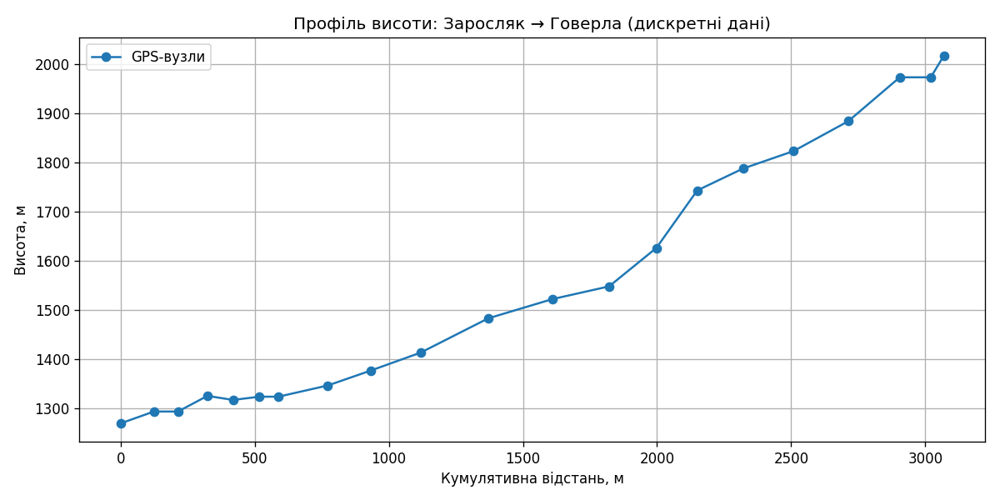
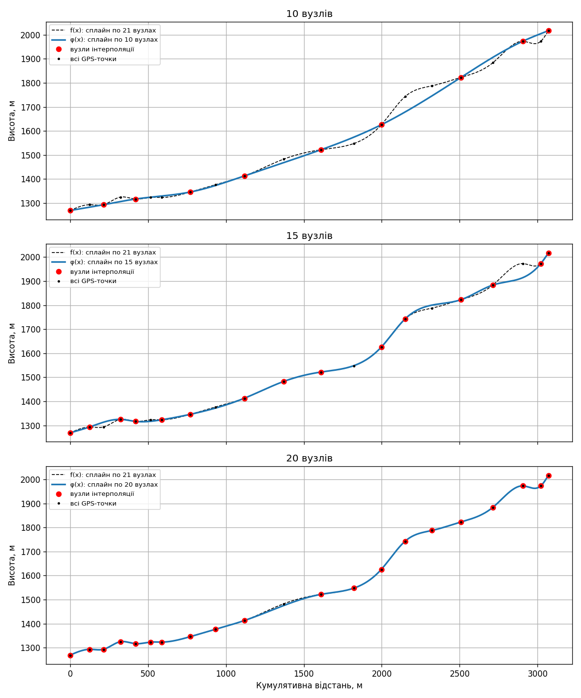
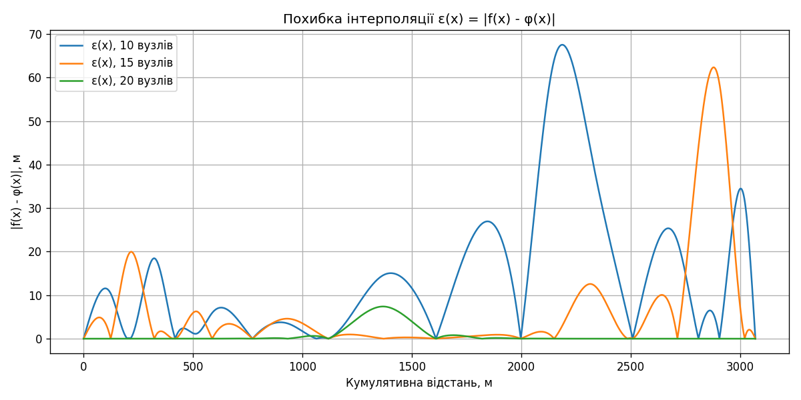
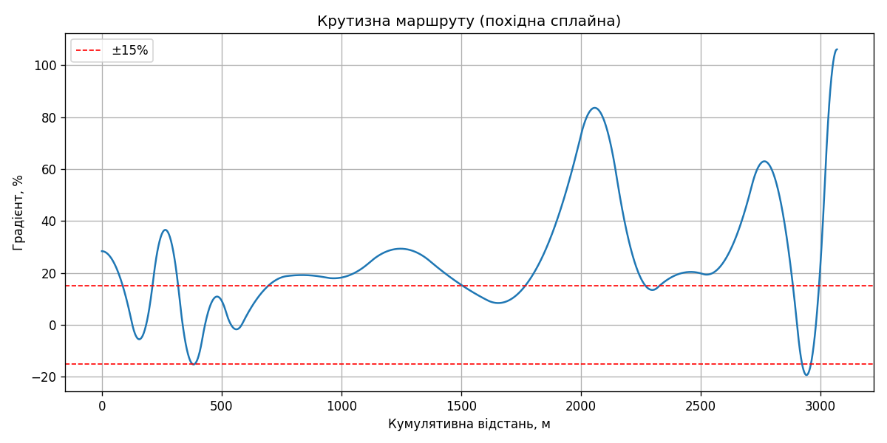

# Лабораторна робота №1

**Тема:** Інтерполяція кубічними сплайнами

**Мета:** вивчити метод інтерполяції кубічними сплайнами та застосувати його
до реальних геоданих — побудувати гладкий профіль висоти маршруту від станції
Заросляк до вершини Говерли й оцінити його складність.

## Теоретичні відомості

На кожному відрізку $[x_{i-1}, x_i]$, $i = 1..n$, сплайн має вигляд

$$S_i(x) = a_i + b_i (x - x_{i-1}) + c_i (x - x_{i-1})^2 + d_i (x - x_{i-1})^3 .$$

Умови: проходження через вузли, неперервність першої та другої похідних у
внутрішніх вузлах, нульова кривизна на кінцях (вільний сплайн):
$c_1 = 0$, $c_{n+1} = 0$. Позначивши $h_i = x_i - x_{i-1}$, отримуємо

- $a_i = y_{i-1}$;
- тридіагональну систему для $c_i$, $i = 2..n$:
  $$h_{i-1} c_{i-1} + 2(h_{i-1} + h_i) c_i + h_i c_{i+1} =
    3\left(\frac{y_i - y_{i-1}}{h_i} - \frac{y_{i-1} - y_{i-2}}{h_{i-1}}\right);$$
- $d_i = \dfrac{c_{i+1} - c_i}{3 h_i}$;
- $b_i = \dfrac{y_i - y_{i-1}}{h_i} - \dfrac{h_i (c_{i+1} + 2 c_i)}{3}$.

Тобто коефіцієнти системи: $\alpha_i = h_{i-1}$, $\beta_i = 2(h_{i-1}+h_i)$,
$\gamma_i = h_i$, $\delta_i$ — права частина.

Система розв’язується **методом прогонки**:

- пряма прогонка: $A_1 = -\gamma_1/\beta_1$, $B_1 = \delta_1/\beta_1$;
  $A_i = \dfrac{-\gamma_i}{\alpha_i A_{i-1} + \beta_i}$,
  $B_i = \dfrac{\delta_i - \alpha_i B_{i-1}}{\alpha_i A_{i-1} + \beta_i}$;
- зворотна прогонка: $x_m = B_m$, $x_i = A_i x_{i+1} + B_i$.

Матриця системи має строгу діагональну перевагу
($|\beta_i| = 2(h_{i-1}+h_i) > h_{i-1} + h_i = |\alpha_i| + |\gamma_i|$),
тому метод стійкий і розв’язок єдиний.

## Хід роботи

Програма: [`main.py`](main.py). Запуск: `python main.py` (потрібні `numpy`,
`matplotlib`, `requests`). Повний вивід консолі — у [`console_output.txt`](console_output.txt).

### 1–3. Запит до API та табуляція

Виконано запит до Open-Elevation API для 21 точки маршруту. Відповідь
збережено у [`route_data.json`](route_data.json) (якщо API недоступне,
програма читає цей файл). Результати табуляції записано у
[`tabulation.txt`](tabulation.txt).

### 4. Кумулятивна відстань

Відстань між сусідніми точками обчислена за формулою гаверсинусів
(R = 6 371 000 м), після чого накопичена.

| №  | Відстань, м | Висота, м | | №  | Відстань, м | Висота, м |
|----|-------------|-----------|-|----|-------------|-----------|
| 0  | 0.00        | 1269.42   | | 11 | 1610.05     | 1521.99   |
| 1  | 123.85      | 1293.43   | | 12 | 1821.16     | 1547.84   |
| 2  | 213.45      | 1293.43   | | 13 | 1997.39     | 1625.94   |
| 3  | 323.50      | 1325.24   | | 14 | 2149.88     | 1742.89   |
| 4  | 418.87      | 1316.99   | | 15 | 2320.63     | 1787.37   |
| 5  | 517.41      | 1323.59   | | 16 | 2508.86     | 1822.82   |
| 6  | 587.78      | 1323.59   | | 17 | 2713.03     | 1883.61   |
| 7  | 771.72      | 1346.29   | | 18 | 2904.98     | 1972.86   |
| 8  | 932.77      | 1376.77   | | 19 | 3020.67     | 1972.86   |
| 9  | 1118.27     | 1413.13   | | 20 | 3069.34     | 2016.72   |
| 10 | 1370.81     | 1482.93   | |    |             |           |

### 5. Графік дискретних даних

### 6–9. Коефіцієнти системи та сплайнів

Для кожного набору вузлів програма виводить у консоль коефіцієнти
тридіагональної системи $\alpha_i, \beta_i, \gamma_i, \delta_i$, розв’язок
$c_i$, знайдений методом прогонки, та коефіцієнти $a_i, b_i, c_i, d_i$.

Перевірка розв’язку: обчислено ліву частину системи з отриманими $c_i$ і
порівняно з вектором вільних членів. Максимальна нев’язка
$\max|A c - \delta| \approx 4.4 \cdot 10^{-16}$, тобто в межах похибки округлення.

Коефіцієнти сплайна за всіма 21 вузлами:

| i  | a_i       | b_i       | c_i         | d_i           |
|----|-----------|-----------|-------------|---------------|
| 1  | 1269.4177 | 0.283699  | 0.00000000  | -0.0000058549 |
| 2  | 1293.4312 | 0.014280  | -0.00217538 | 0.0000225004  |
| 3  | 1293.4312 | 0.166350  | 0.00387262  | -0.0000250560 |
| 4  | 1325.2444 | 0.108349  | -0.00439966 | 0.0000247004  |
| 5  | 1316.9867 | -0.056853 | 0.00266746  | -0.0000143170 |
| 6  | 1323.5867 | 0.051793  | -0.00156489 | 0.0000117789  |
| 7  | 1323.5867 | 0.006539  | 0.00092183  | -0.0000015570 |
| 8  | 1346.2889 | 0.187618  | 0.00006260  | -0.0000003253 |
| 9  | 1376.7689 | 0.182475  | -0.00009454 | 0.0000009037  |
| 10 | 1413.1333 | 0.240688  | 0.00040835  | -0.0000010572 |
| 11 | 1482.9334 | 0.244653  | -0.00039265 | 0.0000002192  |
| 12 | 1521.9911 | 0.094409  | -0.00023536 | 0.0000017439  |
| 13 | 1547.8400 | 0.228198  | 0.00086910  | 0.0000019903  |
| 14 | 1625.9423 | 0.719973  | 0.00192139  | -0.0000105792 |
| 15 | 1742.8933 | 0.567995  | -0.00291807 | 0.0000065427  |
| 16 | 1787.3733 | 0.143748  | 0.00043358  | -0.0000010450 |
| 17 | 1822.8223 | 0.195898  | -0.00015652 | 0.0000032096  |
| 18 | 1883.6133 | 0.533384  | 0.00180945  | -0.0000112844 |
| 19 | 1972.8578 | -0.019248 | -0.00468855 | 0.0000419625  |
| 20 | 1972.8578 | 0.580944  | 0.00987619  | -0.0000676451 |

Коефіцієнти для 10, 15 і 20 вузлів наведено у [`console_output.txt`](console_output.txt).

### 10. Графіки з 10, 15 та 20 вузлами

Вузли вибирались рівномірно за номером з 21 GPS-точки (завжди включаючи
першу та останню).

### 11–12. Вплив кількості вузлів на точність

За «точну» функцію $f(x)$ взято сплайн, побудований за всіма 21 вузлами;
$\varphi(x)$ — сплайн за 10, 15 або 20 вузлами; похибка
$\varepsilon(x) = |f(x) - \varphi(x)|$ обчислена на відрізку
$[0;\ 3069.34]$ м (2000 точок).

| Вузлів | max ε, м | середня ε, м | max похибка в GPS-точках, м |
|--------|----------|--------------|-----------------------------|
| 10     | 67.55    | 14.40        | 64.04                       |
| 15     | 62.36    | 6.40         | 58.63                       |
| 20     | 7.40     | 0.74         | 7.40                        |

**Спостереження:**

- Зі збільшенням кількості вузлів точність зростає: середня похибка
  зменшується з 14.4 м (10 вузлів) до 6.4 м (15) і 0.74 м (20).
- При 10 вузлах сплайн «згладжує» профіль: пропускає крутий підйом на
  2000–2300 м (похибка до 67 м) та локальні перепади на початку маршруту.
  Загальну форму підйому передано правильно, але деталі рельєфу втрачено.
- При 15 вузлах більшість профілю відтворено добре, проте максимальна
  похибка майже не зменшилась (62 м): вона перемістилась на ділянку
  2800–3000 м, де пропущено вузол 18 (1972.86 м) перед плато біля вершини.
  Отже, важлива не лише кількість вузлів, а й те, чи потрапляють вони в
  точки різкої зміни рельєфу.
- При 20 вузлах сплайн практично збігається з еталонним; помітна похибка
  (до 7.4 м) лише на відрізку 1118–1610 м, де пропущено один вузол.
- Похибка дорівнює нулю у вузлах інтерполяції і найбільша посередині
  довгих проміжків між ними, що узгоджується з оцінкою
  $|f - \varphi| = O(h^4)$.

### Додатково: характеристики маршруту

| Показник                            | Значення           |
|-------------------------------------|--------------------|
| Загальна довжина маршруту           | 3069.34 м          |
| Сумарний набір висоти               | 755.56 м           |
| Сумарний спуск                      | 8.26 м             |
| Максимальний підйом (похідна сплайна) | 106.2 %          |
| Максимальний спуск                  | −19.4 %            |
| Середній градієнт (за модулем)      | 25.8 %             |
| Частка маршруту з крутизною > 15 %  | 71.4 %             |
| Механічна робота підйому (80 кг)    | 592 967 Дж ≈ 593 кДж ≈ 141.7 ккал |

Найкрутіші ділянки: 1770–2270 м (до 84 %) та 2330–2885 м (до 63 %), а також
фінальний підйом до вершини (понад 100 % на останніх ~50 м). Маршрут майже
весь час іде вгору, спусків практично немає. Середня крутизна ~26 % і те, що
понад 70 % шляху мають нахил більше 15 %, дозволяють оцінити маршрут як
**складний** (крутий гірський підйом).

## Відповіді на контрольні питання

**1. Що таке табуляція?**
Табуляція — обчислення значень функції (або отримання вимірів) у
послідовності точок та подання їх у вигляді таблиці «аргумент — значення».
У роботі табульовано координати, висоти та кумулятивну відстань.

**2. Що таке інтерполяція?**
Інтерполяція — побудова функції $\varphi(x)$, яка в заданих вузлах $x_i$
набуває заданих значень $y_i$, і використання її для обчислення значень між
вузлами.

**3. Що таке кубічний сплайн?**
Кубічний сплайн — кусково-поліноміальна функція, яка на кожному відрізку між
сусідніми вузлами є многочленом третього степеня, проходить через усі вузли
та має неперервні першу й другу похідні. Фізично — форма гнучкого пружного
стержня, закріпленого у вузлах (мінімізує енергію згину).

**4. Яка система рівнянь виникає при побудові сплайна?**
Система $4n$ лінійних рівнянь щодо $a_i, b_i, c_i, d_i$ (інтерполяція, неперервність
$S'$ та $S''$, крайові умови). Після виключення $a_i, b_i, d_i$ вона зводиться
до системи $n-1$ рівнянь щодо $c_i$ з **тридіагональною** матрицею
з діагональною перевагою.

**5. Що таке метод прогонки?**
Метод прогонки (алгоритм Томаса) — прямий метод розв’язання систем з
тридіагональною матрицею. Складається з прямої прогонки (обчислення
прогонкових коефіцієнтів $A_i, B_i$, так що $x_i = A_i x_{i+1} + B_i$) і
зворотної прогонки (послідовне знаходження $x_m, x_{m-1}, \dots, x_1$).
Потребує $O(n)$ операцій; стійкий при діагональній перевазі.

**6. Який порядок точності кубічного сплайна?**
Для достатньо гладкої функції похибка кубічного сплайна
$\max|f - S| = O(h^4)$, де $h$ — максимальний крок між вузлами; для першої
похідної — $O(h^3)$, для другої — $O(h^2)$.

**7. Які коефіцієнти визначаються при побудові кубічного сплайна та як вони обчислюються?**
Для кожного відрізка — $a_i, b_i, c_i, d_i$:
- $a_i = y_{i-1}$ — з умови проходження через вузол;
- $c_i$ — з тридіагональної системи методом прогонки, з $c_1 = c_{n+1} = 0$;
- $d_i = (c_{i+1} - c_i) / (3h_i)$ — з неперервності другої похідної;
- $b_i = (y_i - y_{i-1})/h_i - h_i (c_{i+1} + 2c_i)/3$ — з проходження через
  правий вузол.

## Висновок

У роботі реалізовано інтерполяцію вільним кубічним сплайном: сформовано
тридіагональну систему для коефіцієнтів $c_i$, розв’язано її методом прогонки
(нев’язка ~$10^{-16}$), обчислено коефіцієнти $a_i, b_i, d_i$. Метод
застосовано до реальних GPS-даних маршруту Заросляк — Говерла (довжина
3.07 км, набір висоти 756 м). Показано, що точність інтерполяції зростає зі
збільшенням кількості вузлів (середня похибка 14.4 → 6.4 → 0.74 м для 10, 15,
20 вузлів), а великі похибки виникають там, де пропущено вузли у точках
різкої зміни рельєфу. Похідна сплайна дала змогу оцінити крутизну маршруту:
понад 70 % шляху має нахил більше 15 %, тому маршрут є складним.
