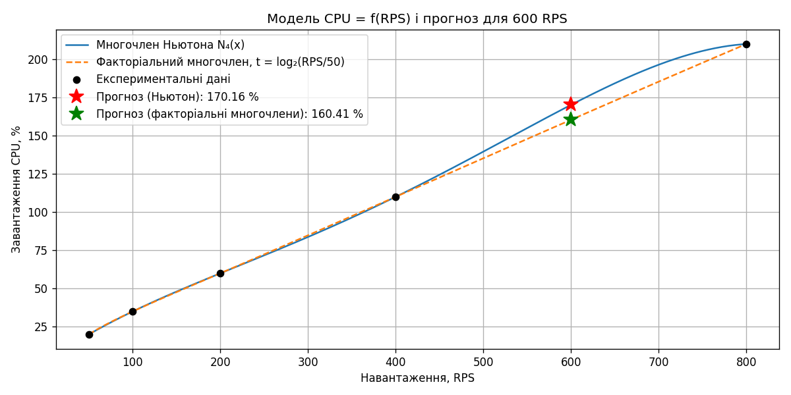
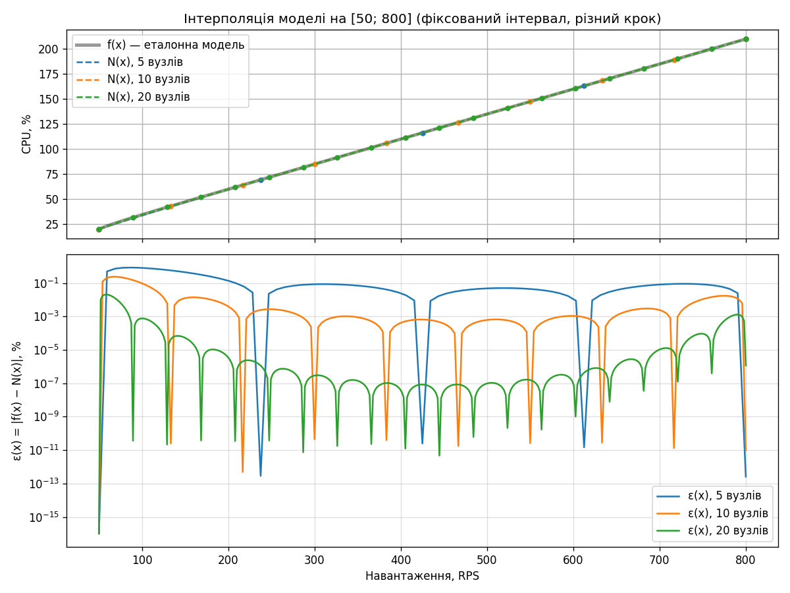
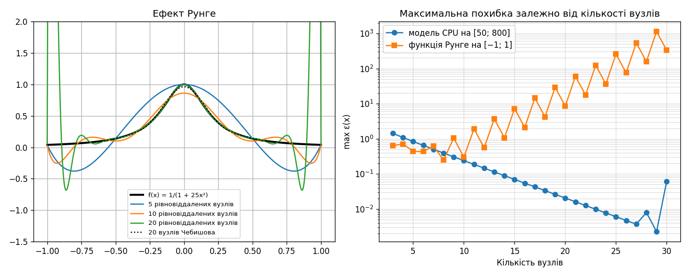

# Лабораторна робота №2

**Тема:** Розділені різниці. Інтерполяційні многочлени Ньютона та факторіальні многочлени

**Варіант 2.** Планування обчислювальних ресурсів (DevOps): прогнозування навантаження на CPU.

**Мета:** вивчити методи обчислення розділених різниць довільного порядку та інтерполяцію
многочленами Ньютона і факторіальними многочленами для довільної конфігурації вузлів.

## Вхідні дані ([`data.csv`](data.csv))

| RPS    | 50 | 100 | 200 | 400 | 800 |
|--------|----|-----|-----|-----|-----|
| CPU, % | 20 | 35  | 60  | 110 | 210 |

Потрібно побудувати модель CPU = f(RPS), оцінити CPU при 600 RPS і дослідити вплив кількості вузлів.

## Основні формули

- Розділена різниця: $f(x_i,\dots,x_{i+k}) = \dfrac{f(x_{i+1},\dots,x_{i+k}) - f(x_i,\dots,x_{i+k-1})}{x_{i+k}-x_i}$,
  або явно $f(x_0,\dots,x_k) = \sum_{i=0}^{k} \dfrac{f(x_i)}{\prod_{j\ne i}(x_i - x_j)}$.
- Многочлен Ньютона: $N_n(x) = f(x_0) + \sum_{k=1}^{n} \omega_{k-1}(x)\, f(x_0,\dots,x_k)$,
  $\omega_k(x) = \prod_{i=0}^{k}(x - x_i)$; похибка $f(x) - N_n(x) = f(x, x_0,\dots,x_n)\,\omega_n(x)$.
- Факторіальні многочлени (рівновіддалені вузли, $t = (x-x_0)/h$):
  $t^{(k)} = t(t-1)\dots(t-k+1)$, $N_n(t) = \sum_{k=0}^{n} \dfrac{\Delta^k f(0)}{k!}\, t^{(k)}$.

## Результати

Програма: [`main.py`](main.py), повний вивід — [`console_output.txt`](console_output.txt).

**Таблиця розділених різниць**

| i | x_i | f(x_i) | 1-й порядок | 2-й порядок | 3-й порядок | 4-й порядок |
|---|-----|--------|-------------|-------------|-------------|-------------|
| 0 | 50  | 20     | 0.3         | −3.3333e−4  | 9.5238e−7   | −1.2698e−9  |
| 1 | 100 | 35     | 0.25        | 0           | 0           |             |
| 2 | 200 | 60     | 0.25        | 0           |             |             |
| 3 | 400 | 110    | 0.25        |             |             |             |
| 4 | 800 | 210    |             |             |             |             |

**Прогноз CPU(600):**

| Метод | CPU(600), % |
|-------|-------------|
| Многочлен Ньютона (5 вузлів) | 170.1587 |
| Многочлен Лагранжа (для порівняння) | 170.1587 |
| Факторіальні многочлени, заміна t = log₂(RPS/50) (вузли t = 0…4, крок 1) | 160.4089 |
| Ньютон за 2, 3 або 4 найближчими вузлами | 160.0000 |

Вузли RPS не рівновіддалені, але утворюють геометричну прогресію, тому для факторіальних
многочленів використано заміну t = log₂(RPS/50). Чотири точки лежать точно на прямій
CPU = 10 + 0.25·RPS, а точка 50 RPS відхиляється на 2.5 % і змінює прогноз многочлена 4-го
степеня на 10 % — модель за всіма вузлами нестабільна, надійніший прогноз ≈ 160 % CPU.

**Дослідження точності** на еталонній моделі f(x) = 10 + 0.25x − 6250/x²
(відхилення від даних ≤ 0.625 %, f(600) = 159.9826 %):

| Вузлів | Інтервал | Крок h | max ε(x), % | Середня ε(x), % |
|--------|----------|--------|-------------|-----------------|
| 5  | [50; 800] | 187.50 | 8.384e−1 | 1.418e−1 |
| 10 | [50; 800] | 83.33  | 2.385e−1 | 1.581e−2 |
| 20 | [50; 800] | 39.47  | 2.052e−2 | 5.852e−4 |
| 5  | [50; 207.89] | 39.47 | 1.126e−1 | 2.712e−2 |
| 10 | [50; 405.26] | 39.47 | 4.808e−2 | 3.681e−3 |

Вузли й табуляція f(x), N(x), ε(x), ω(x) записані у файли `nodes_*.txt` і `tabulation_*.txt`.
Факторіальні многочлени та многочлен Лагранжа на рівновіддалених вузлах збігаються з
многочленом Ньютона.

**Ефект Рунге:** для f(x) = 1/(1 + 25x²) на [−1; 1] max похибка при 5, 10, 20 рівновіддалених
вузлах — 0.438, 0.299, 8.573; 20 вузлів Чебишова — 0.0376. Для гладкої моделі CPU похибка
спадає до 3.7e−3 % при 27 вузлах, далі зростає через похибки округлення.

## Висновок

Реалізовано розділені різниці довільного порядку, многочлени Ньютона, факторіальні многочлени та
многочлен Лагранжа. Прогноз CPU при 600 RPS: 170.16 % (Ньютон), 160.41 % (факторіальні
многочлени), 160 % (2–4 найближчі вузли). Зменшення кроку зменшує похибку інтерполяції, а для
функції Рунге збільшення кількості рівновіддалених вузлів її збільшує.
