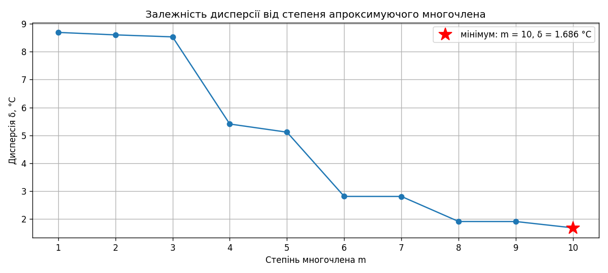
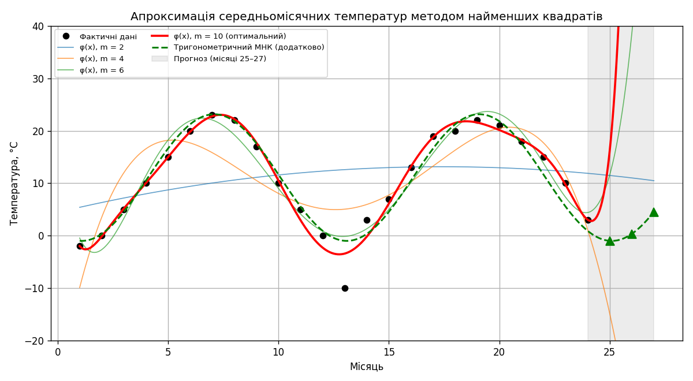
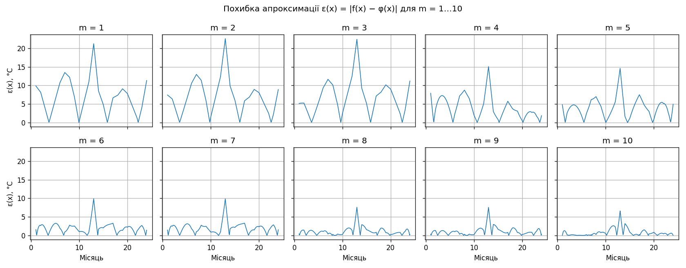

# Лабораторна робота №3

**Тема:** Знаходження алгебраїчних многочленів найкращого квадратичного наближення методом найменших квадратів

**Мета:** вивчити метод найменших квадратів (МНК) знаходження алгебраїчних многочленів найкращого
квадратичного наближення; застосувати його для апроксимації та прогнозування середньомісячних температур.

## Основні формули

- Апроксимуючий многочлен: $\varphi(x) = \sum_{j=0}^{m} a_j x^j$, $m < n$.
- Критерій МНК: $S = \sum_{i=0}^{n} \rho_i (f_i - \varphi(x_i))^2 \to \min$ ($\rho_i = 1$).
- Нормальна система: $\sum_{l=0}^{m} b_{kl} a_l = c_k$, $b_{kl} = \sum_i \rho_i x_i^{k+l}$, $c_k = \sum_i \rho_i f_i x_i^k$.
- Дисперсія: $\delta = \sqrt{\sum_{i=0}^{n} (\varphi(x_i) - f_i)^2 / (n+1)}$.
- Система розв'язується методом Гауса з вибором головного елемента по стовпцях.

## Дані ([`data.csv`](data.csv))

Середньомісячні температури за 24 місяці (°C):
−2, 0, 5, 10, 15, 20, 23, 22, 17, 10, 5, 0, −10, 3, 7, 13, 19, 20, 22, 21, 18, 15, 10, 3.

## Результати

Програма: [`main.py`](main.py), повний вивід — [`console_output.txt`](console_output.txt).

**Нормування аргументу.** Для x = 1…24 і m = 10 число обумовленості матриці B сягає 1.1e28 —
метод Гауса в подвійній точності дає хибний розв'язок. Після заміни t = (x − 12.5)/11.5 ∈ [−1; 1]
воно зменшується до 9.8e6.

| m | δ, °C | cond(B), x | cond(B), t | Прогноз 25 | Прогноз 26 | Прогноз 27 |
|---|-------|------------|------------|------------|------------|------------|
| 1 | 8.6904 | 8.8e2  | 2.8    | 14.61  | 14.89   | 15.17   |
| 2 | 8.6027 | 8.1e5  | 1.3e1  | 11.48  | 11.02   | 10.49   |
| 3 | 8.5309 | 7.7e8  | 5.8e1  | 15.25  | 16.60   | 18.23   |
| 4 | 5.4080 | 7.9e11 | 3.0e2  | −14.84 | −37.58  | −68.36  |
| 5 | 5.1160 | 9.1e14 | 1.5e3  | −25.77 | −61.61  | −112.55 |
| 6 | 2.8140 | 1.2e18 | 8.5e3  | 11.60  | 38.52   | 98.63   |
| 7 | 2.8122 | 8.6e21 | 4.6e4  | 12.89  | 42.71   | 108.72  |
| 8 | 1.9145 | 7.5e22 | 2.7e5  | −26.45 | −109.92 | −309.70 |
| 9 | 1.9136 | 1.8e25 | 1.6e6  | −28.17 | −117.85 | −334.35 |
| 10 | 1.6862 | 1.1e28 | 9.8e6 | 16.22  | 121.85  | 506.32  |

Мінімум дисперсії — при **m = 10** (δ = 1.6862 °C). Похибка у вузлах: середня 0.90 °C,
максимальна 6.59 °C у місяці 13 (аномально холодний −10 °C).

Похибка ε(x) = |f(x) − φ(x)| протабульована з кроком h/20 = 0.05 для m = 1…10 у файлі
[`errors.txt`](errors.txt) (між вузлами f(x) — лінійна інтерполяція).

**Прогноз.** Многочлен m = 10 дає 16.22, 121.85 і 506.32 °C для місяців 25–27 — екстраполяція
алгебраїчним многочленом високого степеня ненадійна. Додатково тим самим МНК побудовано
наближення з тригонометричним базисом φ(x) = 11.08 − 10.15·cos(2πx/12) − 6.53·sin(2πx/12)
(δ = 2.54 °C), яке дає реалістичний прогноз: **−0.97, 0.35 і 4.55 °C** (у першому році: −2, 0, 5 °C).

## Висновок

МНК з розв'язанням нормальної системи методом Гауса з вибором головного елемента добре апроксимує
дані всередині відрізка (мінімум дисперсії при m = 10), але потребує нормування аргументу для
стійкості обчислень. Для прогнозу періодичних даних алгебраїчні многочлени непридатні — доцільно
використовувати тригонометричний базис.
